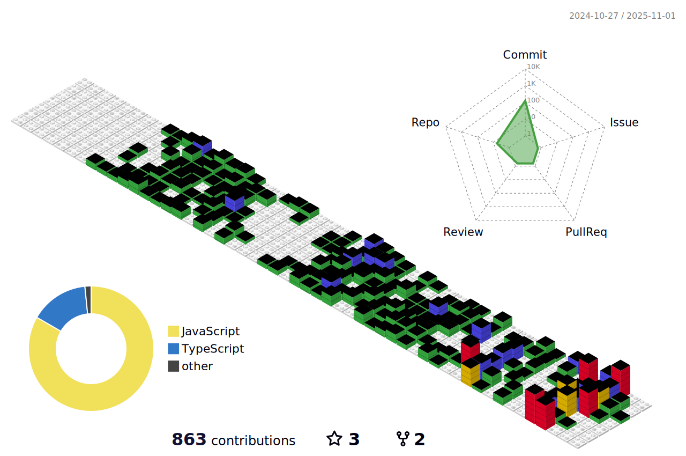

  <h1 align="center">
    
</h1>

  Seeking new opportunities to grow and contribute as a React Developer.

 

    
     

  <h2>🐍 My Contributions 🐍</h2>
   

  
  
     

<h2 align="center">⚡ Stats ⚡</h2>
 

  
  
  
  

## 📫 Contact Me

  I am always open to discussing new projects, creative ideas, or opportunities to be part of your vision. Feel free to connect with me via:

    

